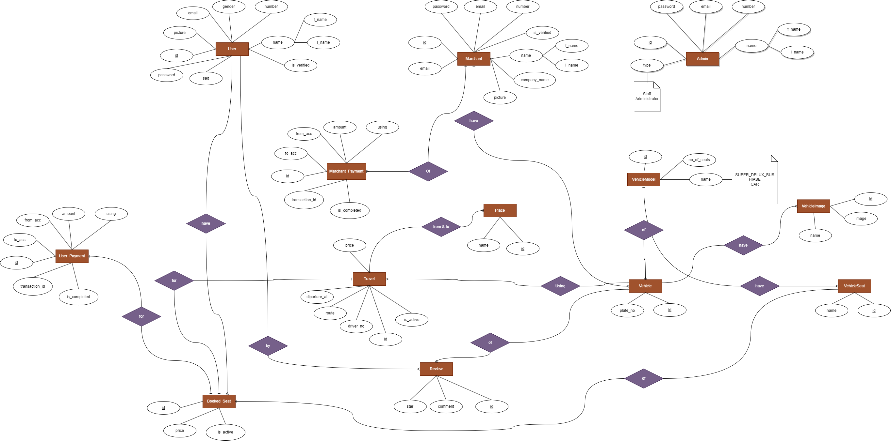

[<h1 style="font-size:60px; width:100%;">Journey</h1>](./appIcon.ico)

# 🚗 Easier way to buy Bus, HiAce Ticket Online & Book Vehicles 🚌

## NOTE: Project is still under development Phase

# System Overview:
* Whole System is been created in multiple technologies and uses Microservice Architecture.
* Followed CI/CD pipeline and doing testing and deployment using Github Action.
* Building the Docker Images of all the Microservice and pushing into Docker hub public registry.
* Deploying the Kubernetes Manifests of all the Microservice Applications into Google GKE & AWS EKS Cluster.

# Microservices App Explanation:
## 1. [API Gateway:](https://github.com/roman-ojha/journey/tree/staging/api-gateway)
* #### Short Explanation: (Todo.)
* #### Technologies Used:
    * NodeJS & Express
    * PostgreSQL
    * MySQL

## 2. [Main Proxy:](https://github.com/roman-ojha/journey/tree/staging/temp-main-proxy)
* #### Short Explanation: (Todo.)
* #### Technologies Used:
  * Nginx (for Reverse Proxy)
  
## 3. [Admin Service:](https://github.com/roman-ojha/journey/tree/staging/admin-service)
* #### Short Explanation: (Todo.)
* #### Technologies Used:
  * Django Rest Framework
  * PostgreSQL
  * MySQL
  * MongoDB
  
## 4. [Merchant Service:](https://github.com/roman-ojha/journey/tree/staging/merchant-service)
* #### Short Explanation: (Todo.)
* ### Technologies Used:
  * Laravel
  * MySQL

## 5. [Merchant Vehicle & Travel Service:](https://github.com/roman-ojha/journey/tree/staging/merchant-vehicle-and-travel-service)
* #### Short Explanation: (Todo.)
* ### Technologies Used:
  * NodeJS/ExpressJS
  * MongoDB
  * Prisma ORM

## 6. [User Service:](https://github.com/roman-ojha/journey/tree/staging/user-service)
* #### Short Explanation: (Todo.)
* ### Technologies Used:
  * NodeJS/ExpressJS
  * PostgreSQL

## 7. User Vehicle Service:
* #### Short Explanation: (Todo.)
* ### Technologies Used:
  * Django
  * MongoDB

## 8. User Booking Service:
* #### Short Explanation: (Todo.)
* ### Technologies Used:
  * NodeJS/ExpressJS
  * MongoDB

## 9. User Review Service:
* #### Short Explanation: (Todo.)
* ### Technologies Used:
  * FastAPI
  * MongoDB

## 10. Vehicle Booking Service:
* #### Short Explanation: (Todo.)
* ### Technologies Used:
  * Django
  * MongoDB

## 11. [API Docs:](https://github.com/roman-ojha/journey/tree/staging/api-docs-service)
* #### Short Explanation: (Todo.)
* ### Technologies Used:
  * NodeJS
  * Swagger

### Functional Requirement:
* User can be able to Register & logged into the system
* User can be able to Pick From & To Places to find the best possible Vehicle.
* User can View all the seats which are available and are already booked.
* User can book the seats with given price by paying through payment gateway service
* User can view all the reviews done for that specific Vehicle Service.
* User can review the specific Vehicle after they have take the service.
* Merchant can Register with given minimal charge and logged into the Merchant Site.
* Merchant can list all the available Vehicle with required details.
* Merchant can update the listed vehicles or remove it from the list.
* Admin can logged into the Admin Site.
* Admin can approved & Disapprove the merchant who are trying to register.
* Admin can do have control of any sort of Users, Merchants & Admin data as per their permissions.

### Git Branches:
1. development:
    * development phase
2. staging:
    * merge to staging brach so that developer can see the preview deployment of the application deployed on cloud service.
3. main:
    * merge to main branch so that end user can access the application, Also we can called it as production branch.

### System Design
[</img>](./assets/Design/System-Design.png)

### ER Diagram
[</img>](./assets/Design/ER-Diagram.drawio.png)

### References:
* MongoDB Integration on Laravel: https://www.mongodb.com/compatibility/mongodb-laravel-integration