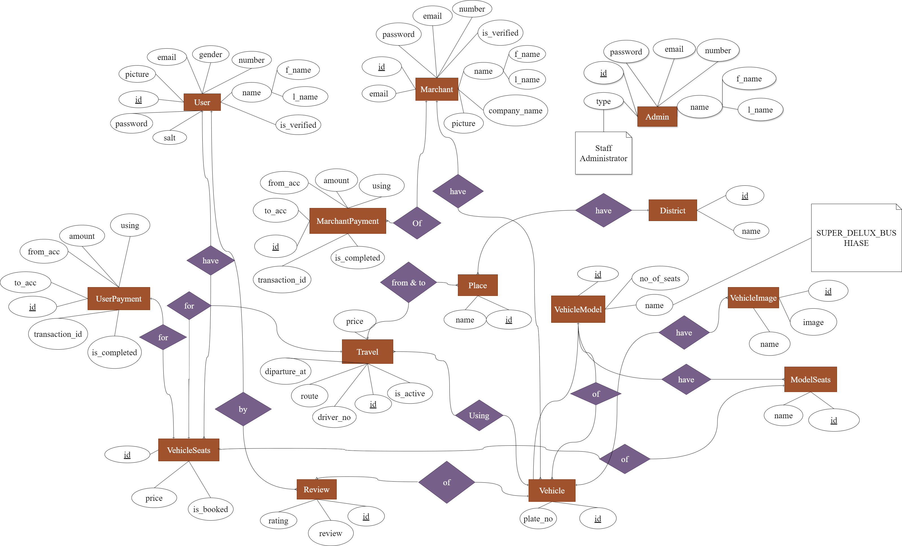

[<h1 style="font-size:60px; width:100%;">Journey</h1>](./appIcon.ico)

# 🚗 Easier way to book Bus, HiAce Seats Online 🚌

## Disclaimer: Project is still under development Phase

# System Overview:
* Platform have 3 user: Admin, Client User, Merchant
* Client User can search or explore vehicle which merchant have added on to our platform.
* We have used Collaborative or Popularity based filtering ML Algorithms based on given user to recommend best vehicle.
* Client User can book seats using given payment gateway service.
* Whole System is been created in multiple technologies and uses Microservice Architecture.
* Followed CI/CD pipeline and doing testing and deployment using Github Action.
* Building the Docker Images of all the Microservice and pushing into Docker hub public registry.
* Deploying the Kubernetes Manifests of all the Microservice Applications into Google GKE & AWS EKS Cluster.

### System Design
[</img>](./assets/Design/System-Design.png)

# Microservices & Application:
## 1. [User Client:](https://github.com/roman-ojha/journey/tree/staging/user-client)
* Main User interface to interact with our platform
* Technologies and Important Libraries Used: Next.js 14, Sass, TailwindCSS, ShadCn UI, Material UI, React Query, Redux Toolkit, React Hook Form, Zod

<!-- ## 3. [Merchant Client:](https://github.com/roman-ojha/journey/tree/staging/api-gateway)
* Short Explanation: (Todo.)
* Technologies Used:
    * Flutter | React Native -->

## 2. [Main Proxy:](https://github.com/roman-ojha/journey/tree/staging/main-proxy)
* Main door to request for our application and forward the request to appropriate microservices
* Technologies Used: Nginx

## 3. [API Gateway:](https://github.com/roman-ojha/journey/tree/staging/api-gateway)
* Authenticate User or Merchant and then forward the request to appropriate microservices.
* Technologies Used: NodeJS with Express, PostgreSQL, MySQL, PrismaORM

## 4. [User Service:](https://github.com/roman-ojha/journey/tree/staging/user-service)
* Handle user registration, login etc...
* Technologies Used: NodeJS/ExpressJS, PostgreSQL, PrismaORM, GCP Storage

## 5. [User Vehicle Review Service](https://github.com/roman-ojha/journey/tree/staging/user-vehicle-review-service)
* Handle reviewing vehicle or fetching information about vehicle reviews.
* Technologies Used: NodeJS/ExpressJS, MongoDB, PostgreSQL, MySQL, PrismaORM

## 6. [User Vehicle Booking Service](https://github.com/roman-ojha/journey/tree/staging/user-vehicle-booking-service):
* Handle vehicle seats booking services.
* Technologies Used: Django rest framework, MongoDB

## 7. [User Vehicle Service](https://github.com/roman-ojha/journey/tree/staging/user-vehicle-service):
* Handle exploring, searching vehicle related information.
* Use Collaborative and Popularity based filtering Algorithms.
  * [Vehicle recommendation system](./user-vehicle-service/explore_vehicle_recommendation_system.ipynb)
* Technologies Used: FastAPI, MongoDB

## 8. [Admin Service:](https://github.com/roman-ojha/journey/tree/staging/admin-service)
* Handle all the request done by admin.
* Technologies Used: Django Rest Framework, PostgreSQL, MySQL, MongoDB

## 9. [Merchant Service:](https://github.com/roman-ojha/journey/tree/staging/merchant-service)
* Handle merchant registration, login etc...
* Technologies Used: Laravel, MySQL

## 10. [Merchant Vehicle & Travel Service:](https://github.com/roman-ojha/journey/tree/staging/merchant-vehicle-and-travel-service)
* Handle CRUD related to vehicle and travels done by auth merchant.
* Technologies Used: NodeJS with ExpressJS, MongoDB, Prisma ORM

## 11. [API Docs:](https://github.com/roman-ojha/journey/tree/staging/api-docs-service)
* Done API documentation for testing.
* Technologies Used: NodeJS, Swagger

## 12. [Admin Client:](https://github.com/roman-ojha/journey/tree/staging/admin-service)
* Initial Admin UI template has been fork from [altence/lightence-ant-design-react-template](https://github.com/altence/lightence-ant-design-react-template)

### User Client Interface
#### 1. Register Page
[</img>](./assets/UI/user-register.png)

#### 2. Login Page
[</img>](./assets/UI/user-login.png)

#### 3. Home Page
[</img>](./assets/UI/user-home.png)

#### 4. Explore | Searched vehicle page
[</img>](./assets/UI/user-explore.png)

#### 5. Vehicle Detail page
[</img>](./assets/UI/user-vehicle-detail.png)

### ER Diagram
[</img>](./assets/Design/ER-Diagram.drawio.png)

### Functional Requirements:
* User can be able to Register & logged into the system
* User can be able to Pick From & To Places to find the best possible Vehicle.
* User can View all the seats which are available and are already booked.
* User can book the seats with given price by paying through payment gateway service
* User can view all the reviews done for that specific Vehicle Service.
* User can review the specific Vehicle after they have take the service.
* Merchant can Register with given minimal charge and logged into the Merchant Site.
* Merchant can list all the available Vehicle with required details.
* Merchant can update the listed vehicles or remove it from the list.
* Admin can logged into the Admin Site.
* Admin can approved & Disapprove the merchant who are trying to register.
* Admin can do have control of any sort of Users, Merchants & Admin data as per their permissions.

### Git Branches:
1. development:
    * development phase
2. staging:
    * merge to staging brach so that developer can see the preview deployment of the application deployed on cloud service.
3. main:
    * merge to main branch so that end user can access the application, Also we can called it as production branch.
