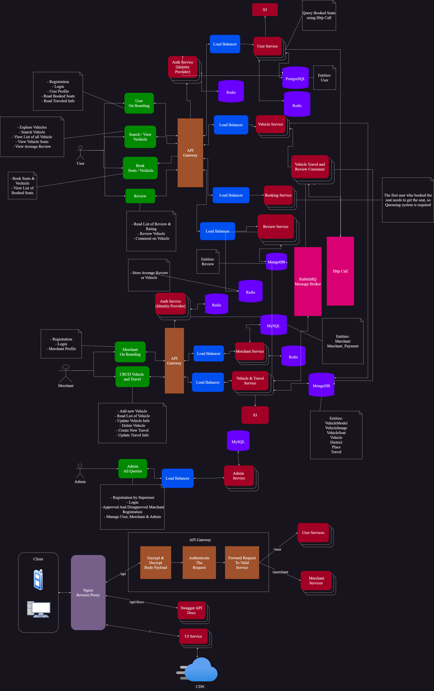

[<h1 style="font-size:60px; width:100%;">Journey</h1>](./appIcon.ico)

# 🚗 Easier way to buy Bus, HiAce & Book Cars 🚌

## NOTE: Project is still in development Phase

### System Overview:
* Whole System is been created in multiple technologies using Microservice Architecture.
* Followed CI/CD pipeline and doing testing and deployment using Github Action.
* Building the Docker Images of all the Microservice and pushing into Docker hub public registry.
* Deploying the Kubernetes Manifests of all the Microservice Applications into Google GKE & AWS EKS Cluster.

### Technology Used:
| Services                          | Technologies                       |
| --------------------------------- | ---------------------------------- |
| API Gateway                       | Express, PostgreSQL, MySQL         |
| Main Proxy                        | Nginx Reverse Proxy Server         |
| Admin Service                     | Django, PostgreSQL, MySQL, MongoDB |
| Merchant Service                  | Laravel, MySQL                     |
| Merchant Vehicle & Travel Service | Laravel, MongoDB                   |
| User Service                      | Express, PostgreSQL                |
| User Vehicle Service              | Django, MongoDB                    |
| User Booking Service              | Express, MongoDB                   |
| User Review Service               | FastAPI, MongoDB                   |
| Vehicle Booking Service           | Django , MongoDB                   |
| API Docs                          | Swagger                            |
| Caching                           | Redis                              |
| Message Broker                    | RabbitMQ                           |

### Functional Requirement:
* User can be able to Register & logged into the system
* User can be able to Pick From & To Places to find the best possible Vehicle.
* User can View all the seats which are available and are already booked.
* User can book the seats with given price by paying through payment gateway service
* User can view all the reviews done for that specific Vehicle Service.
* User can review the specific Vehicle after they have take the service.
* Merchant can Register with given minimal charge and logged into the Merchant Site.
* Merchant can list all the available Vehicle with required details.
* Merchant can update the listed vehicles or remove it from the list.
* Admin can logged into the Admin Site.
* Admin can approved & Disapprove the merchant who are trying to register.
* Admin can do have control of any sort of Users, Merchants & Admin data as per their permissions.

### Git Branches:
1. development:
    * development phase
2. staging:
    * merge to staging brach so that developer can see the preview deployment of the application deployed on cloud service.
3. main:
    * merge to main branch so that end user can access the application, Also we can called it as production branch.

### System Design
[</img>](./assets/Design/System-Design.png)